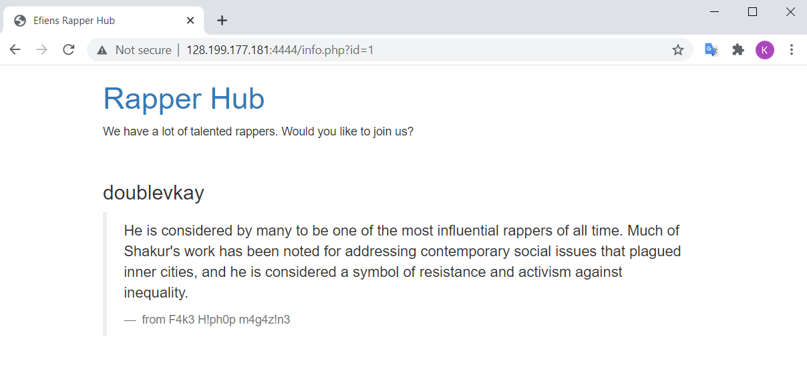
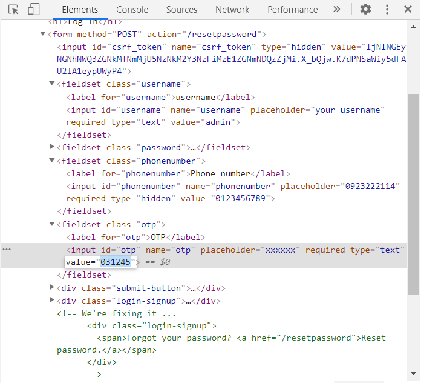
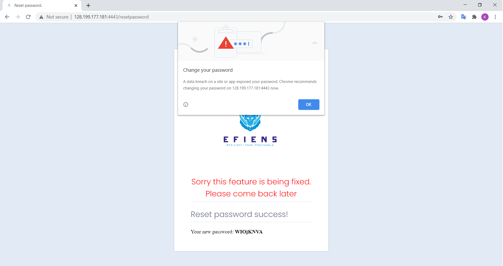

# EfiensCTF-Writeup-Round-2
> Short write-up for CTF Problems from EfiensCTF 2020 Round 2

EfiensCTF 2020, organized and hosted by HCMUT Information Security club [Efiens](https://blog.efiens.com), is the entrance competition for recruiting new members in our university for this year. The CTF includes 2 rounds, which took place on 17/10 and 12/12, respectively. The first round is an online 10-hour introductory-level contest mostly for familiarizing with CTF concepts. The second round is originally an onsite 7-hour jeopary-style CTF, but after that, it was opened for everyone to join and attempt to solve the challenges in around one week. This write-ups attempt to summarize the process of solving the CTF challenges presented in the second round of EfiensCTF 2020.

The challenges were hosted on Efiens' [CTF Website](http://45.77.254.247/challenges)

## Introduction

Since this CTF is intended as the recruitment challenge for starters in information security, most round-2 challenges were beginner-to-intermediate problems for familiarizing with the thought process and techniques. There are a total of 19 challenges, in 4 areas: Pwnable, Reverse Engineering, Web Exploitation, and Cryptography. I managed to solve 8 problems during the onsite contest time, and 5 further more (so far) during the open contest. Of course, since the CTF is intended to be fully solved in 6-7 hours, this number is nothing but pathetically rookie. Still, I find the process of thinking and solving the challenges really interesting and helpful, so I would like to present the writeup to anyone who is interested in joining Efiens in the future, or is simply into information security.

## Challenge Set
The following tables lists out the challenges I solved during the contest time. All challenge files and solutions can be found [here](https://github.com/mkbui/EfiensCTF-Writeup/tree/main/round2). Unless otherwise stated, I do not own any of the files included and referenced in this repos, which were all created by Efiens' members. List of references are at the end, while noteworthy help, advice and suggestions are also mentioned in the write-ups. 

| **Category**      | **Challege Name**                    |
|-------------------|--------------------------------------|
| Crypto  | [ROT1000](#rot1000)   |
| Crypto  | [Baby RSA](#baby-rsa) |
| Crypto  | [ECBC](#ecbc)         |
| Crypto  | [Four time pad](#four-time-pad) |
| Web     | [Cave of wonder](#cave-of-wonder) |
| Web     | [Tiểu cường học Nodejs](#tiểu-cường-học-nodejs) |
| Web     | [Rapper hub](#rapper-hub) |
| Web     | [Trust bank is back](#trust-bank-is-back) |
| RE      | [Easy MIPS](#easy-mips)     |
| RE      | [Single Byte](#single-byte) |
| Pwn     | [Lottery](#lottery)   |
| Pwn     | [Luck](#luck)         |
| Pwn     | [ROP](#rop)           |

Note that this list only contains problem that I solved, which were not completed. 


## ROT1000

> Source files : [chall.py](./crypto/rot1000/chall.py)

The source details the process of encrypting and encoding the flag using a variety of methods.

```python
def rot(s, num):
    return ''.join(ALPHABET[(ALPHABET.index(x) + num) % len(ALPHABET)] if x in ALPHABET else x for x in s)

def encrypt(c):
    cipher = c
    x = random.randint(1, 1000)
    for i in range(x):
        cipher = rot(cipher, random.randint(1,26))
    cipher = b64encode(cipher.encode())

    l = b""
    for i in range(len(cipher)):
        l += bytes([cipher[i] ^ cipher[(i+1)%len(cipher)]])
    return b64encode(l).decode()

# cipher = Z1kqFGZqFhoDLSE8VAhpBWVANhIBPQ4wEAgbA2cJDn0db2EKOSECHQNvdBo7CAIwAy0hAWsDDWs=
```

The process steps are depicted as followed:
1. The plaintext (consisting of all uppercase character and `{`, `}`) is modified by the `rot` function for `x` number of times, where `x` is a randomly generated number between 1 and 1000. Upon inspection of `rot`, we can see that this function performs the same Caesar shift cipher on the message, which the shift key also randomly generated between `1` and `26`. 
2. The resulting ciphertext is then wrapped into a base64 encoding object called `cipher`, which stores the text as an array of base64 characters.
3. The process now encrypts the object into a new byte string as followed: the value of the byte at each position is produced by XORing the two neighboring base64 characters of `cipher` at that position and its next one (for the last character, it is XORed with the first one).
4. The resulting final ciphertext is encoded into base64 form using the `base64encode` object.

As we can see, this is a linear process where each step is independent of each other. Thus, we attempt to reverse the process and decrypt the original message from the last step back to the first one:

1. We obtain the byte string at the beginning of step 4 by wrapping the ciphertext in a `base64decode` object, which is Python's counterpart object for `base64encode`. 
```python
l = b64decode(cipher)
```

2 & 3. Although the encryption process looks complicated, the property of XOR allows us to recover the whole message provided knowledge of a single correct character in the original message. For example, if we know `cipher[0]`, we can calculate `cipher[1] = l[0] ^ cipher[0]`, `cipher[2] = l[1] ^ cipher[1]`, and so forth. Therefore, we don't actually need to bruteforce every possible combination of the byte string, we just need to bruteforce the first letter of `cipher`. Since the ROT encryption only produces alphabetical uppercase character, we have 26 possibility to try. How to determine which first character is valid? Notice that `cipher` only consists of valid ASCII characters (more specifically, uppercase alphabet and the brackets), which can be safely decoded into an ASCII string by Python. If the first character is wrong, there is very high possibility the resulting reversed byte string will contain non-ASCII byte values. Therefore, we can use exception handling to return just the valid choice of first character:

```python
first = 'A'
while (True):
    guess = first.encode()
    for i in range(len(l)):
        guess += bytes([l[i] ^ guess[i]])

    try:
        cipher = b64decode(guess).decode()
        break
    except:
        pass

    first = chr(ord(first) + 1)
```    

Note that `b64decode(guess).decode()` also does the base64 decoding presented in encryption step `2`.

4. Finally, we need to recover the original plaintext by cryptanalysing Caesar cipher, now in 1000 times. It is visible no matter how many times `rot` was produced, the resulting cipher will always be shifted with a fixed number for every character in the string. Therefore, we only need a linear 26 tries at most to discover the plaintext. However, as we already know the first letter in the plaintext should be `E` in `EFIENSCTF{...}`, the number of tries is only 1: calling `rot` with a supplied shift as the difference between `E` and the first letter in `cipher`.

```python
print(rot(cipher, (ord('E') - ord(cipher[0])) % len(ALPHABET)))
```

We obtain the flag as `EFIENSCTF{_WARMUP_BABE_:)_ENJOY_THE_CTF_}`.

The message in the challenge flag is more terrifying than the challenge itself.

## Baby RSA

> Source files: [chall.py](./crypto/babyrsa/chall.py)

The challenge shows us the source, which depicts the process of RSA encryption with some additional information.

```python
def leak(x, n=512, rate=0.45):
    cc = list(range(n))
    shuffle(cc)
    cc = cc[:int(rate*n)]
    bit = list(bin(x)[2:].zfill(n))
    for i in cc:
        bit[i] = 'x'
    return '0b' + ''.join(bit)


p = getPrime(512)
q = getPrime(512)
n = p*q
m = bytes_to_long(flag.encode())
c = pow(m, 65537, n)

print(f'n = {n}')
print(f'p = {leak(p)}')
print(f'q = {leak(q)}')
print(f'c = {c}')

# n = 79753459280206880128113574432814937699658173430959080655543409042957247559575129669546574580450020074729891652719995259102247118118129856047047260436761118020607272628218875167846537090248986069614704056782852058656553098641635416733510555297527445944922605886852081480971490040604366056053007281766327844861
# p = 0b1x01x000xx11x01xx0110xxx100xxx1x0xx1x10x010110xx1x1xx0xx0001xx01xx0xxx1xx00xxxx1x0xx0x0x10x11xx100x0xxx10x1x1x01xx00110xx1x1x00xx0x0x11100xx0x11x1x1xxxx1x1xx0x00x01x110xx1001x1x0x1x11xx010x1x100xx0x1x0x1000x0x0x110x1x110x00x01x10001x0x0xxxx000xxx0x1xx011x0x1001x0x0xxx001x1xxx11010xx1xx100x1x00110xx00xx001xx0010xxxx0xxx10110xx1xx1x11xx1x01xx1xxxx00x01x10x1110x1000x0x0xxxx000x0x1110000x1010x1010xxxx1x0xxx0xx0xxx0x111x0x0xxx0x1xxx00x0xxx0xxxx0x11x00x110x00xx1x0x11xxx0x10x110x00xx001111x1x00001xxx01xxx11xxx10x1
# q = 0b1100xx0xxxxx11x0xxxxxx0x1x1x0xxxxx0x100xx01xxx0xxx0xx0x0xx1000xxx0x111x1xxx0x000111x1xx1xx0x1x010011x1x1x10100x1xxx000x10x1xx01xxx1x0000xx10111xxxxxx010xx1x011x10xxxx0001010110x100xxx0111x000x1xxxx00x00011xx1000x0101x0010xxx001xxxxxxxx1x11xxx0xx0xx11x0xxx01xx00011xx0xx1x1x1x100x1x001xx1x100x01111xxxx100x11xx00010x10xx010xx1xx1x1100x00x0x0x0xx1xxxxxx100x1001x01xx010x100x111x111x1xxx1xxx0x01xxx1xx0xx1x110000xx0x00xx10100x111xxx101x1xxxx1001111xxx101xxxxxxx1001x0xxx01x1100001x001x0001xx1x00x0xx0110x01xx0xx01xx
# c = 69798571987059279536020048590380044210697540311399633826675257935676764846459954894967850784513288877022680859815373044798758357399449803892309076689360603234922881853951574595305273158929170599103698971345765935160435747059203310715064910469854375945380312715370629665433775374987617013660468800917779452238

```

The source provided knowledge of the modulus `n`, the public key `e`, and the ciphertext `c` as usual. However, additionally there is a partial sneak-peek into the prime components `p` and `q`, which reveals a random 55% bits of each (the remaining 45% unrevealed bits will be denoted by the `x` character, as seen in the `leak` function and the output).

The topic of leaked components cryptanalysis in RSA is pretty popular, and in this case we attempt to fully recover the plaintext with partial knowledge of the factorization of `n`. First, we use the principle of modular arithmetic: 
```
p * q = n   <=>   last_i( last_i(p) * last_i(q) ) = last_i(n)
```
with `last_i` denoting the last `i` trailing bits of the number. 

With this knowledge, we can try to linearly cryptanalyze `p` and `q` by finding possible combinations of the last `i` bits of `p` and `q` whose product has the same `i` trailing bits as `n`. `i` is then incremented by 1 each, until we come to the final list of possible full-bit combinations of `p` and `q` that satisfies the condition. Normally, if we have absolutely zero knowledge of the two primes, it would produce `2**511` combinations (due to the primes being 512-bit long), which is no better than factorizing `n` directly. However, with the leaked bits, the number of possibles combinations significantly decreases - in fact, with 55% revelation rate, the resulting list of this problem only has 78 elements in total.

Using the output, we create the list by going from the last bit of `p` and `q` up to the 512th:
```python
n = 79753459280206880128113574432814937699658173430959080655543409042957247559575129669546574580450020074729891652719995259102247118118129856047047260436761118020607272628218875167846537090248986069614704056782852058656553098641635416733510555297527445944922605886852081480971490040604366056053007281766327844861
p = "1x01x000xx11x01xx0110xxx100xxx1x0xx1x10x010110xx1x1xx0xx0001xx01xx0xxx1xx00xxxx1x0xx0x0x10x11xx100x0xxx10x1x1x01xx00110xx1x1x00xx0x0x11100xx0x11x1x1xxxx1x1xx0x00x01x110xx1001x1x0x1x11xx010x1x100xx0x1x0x1000x0x0x110x1x110x00x01x10001x0x0xxxx000xxx0x1xx011x0x1001x0x0xxx001x1xxx11010xx1xx100x1x00110xx00xx001xx0010xxxx0xxx10110xx1xx1x11xx1x01xx1xxxx00x01x10x1110x1000x0x0xxxx000x0x1110000x1010x1010xxxx1x0xxx0xx0xxx0x111x0x0xxx0x1xxx00x0xxx0xxxx0x11x00x110x00xx1x0x11xxx0x10x110x00xx001111x1x00001xxx01xxx11xxx10x1"
q = "1100xx0xxxxx11x0xxxxxx0x1x1x0xxxxx0x100xx01xxx0xxx0xx0x0xx1000xxx0x111x1xxx0x000111x1xx1xx0x1x010011x1x1x10100x1xxx000x10x1xx01xxx1x0000xx10111xxxxxx010xx1x011x10xxxx0001010110x100xxx0111x000x1xxxx00x00011xx1000x0101x0010xxx001xxxxxxxx1x11xxx0xx0xx11x0xxx01xx00011xx0xx1x1x1x100x1x001xx1x100x01111xxxx100x11xx00010x10xx010xx1xx1x1100x00x0x0x0xx1xxxxxx100x1001x01xx010x100x111x111x1xxx1xxx0x01xxx1xx0xx1x110000xx0x00xx10100x111xxx101x1xxxx1001111xxx101xxxxxxx1001x0xxx01x1100001x001x0001xx1x00x0xx0110x01xx0xx01xx"

l = len(p)
possible = [("", "")]
for i in range(len(p)):
  newlist = []
  pguess = ["0", "1"] if p[l-i-1] == "x" else [p[l-i-1]]
  qguess = ["0", "1"] if q[l-i-1] == "x" else [q[l-i-1]]
  
  for ps in pguess:
    for qs in qguess:
      for s in possible:
        pnew = ps + s[0]
        qnew = qs + s[1]
        if (((int(pnew, 2) * int(qnew, 2)) % (1 << i+1)) == (n % (1 << i+1))): newlist += [(pnew, qnew)]

  possible = newlist

print(len(possible)    #78
```

After this, finding which combination actually produces the correct modulus `n` is simple. 

```python
for s in possible:
  ptrue = int(s[0], 2)
  qtrue = int(s[1], 2)
  if ptrue * qtrue == n: 
    totient = (ptrue-1)*(qtrue-1)
    d = inverse(65537, totient)
    print(long_to_bytes(pow(c, d, n)).decode())
    break
```

Flag: `EFIENSCTF{___Basic_RSA_chall_:)___}`

# ECBC

> Source files: [chall.py](./crypto/ecbc/chall.py)

The source file details a web service that encrypts the flag using a combination of `ECB` and `CBC` block cipher modes:

```python
BS = 16

def pad(m):
    if len(m) % BS == 0:
        return m
    return m + bytes(BS - len(m) % BS)

def encrypt(m):
    c = []
    m = pad(m)
    n = bytes_to_long(FLAG)
    for _ in range(len(FLAG) * 8):
        if n & 1:
            c.append(AES.new(os.urandom(BS), AES.MODE_ECB).encrypt(m))
        else:
            c.append(AES.new(os.urandom(BS), AES.MODE_CBC, os.urandom(BS)).encrypt(m))
        n >>= 1
    return c

if __name__ == '__main__':
    message = bytes.fromhex(input())
    for x in encrypt(message):
        print(x.hex())
```

In summary, we need to send a hex message to the oracle, which will be padded to 16-byte blocks. The service oracle then encrypts our messages based on the flag bits. For each bit, if it is `1`, the cipher mode will be `ECB`, else, the cipher mode will be `CBC`. Note that the key and the Init Vector (for `CBC`) are all randomly generated every bit check. The encrypted message is then sent back to us, again, bit by bit corresponding with the flag bit length.

As we can see, the challenge here is to detect if the ciphertext sent from the server is encrypted using `ECB` or `CBC` mode. This is pretty simple if you already have some knowledge regarding the block cipher mode of operations. In this case, I use an important (and very susceptible) characteristic of `ECB` mode: **the mode separated our message into 16-byte blocks to encrypt each with the provided key, and if two blocks are identical, the resulting 16-byte encrypted blocks will also be identical**. This means if, for example, we send a 32-byte message to the server with the first 16 bytes identical to the last 16 bytes, the resulting message sent back to us will also contain a 32-byte ciphertext with identical parts. For `CBC`, this will not happen for almost every case due to the fact that each next block depends on both the key and the previous block's encrypted result.

We can then simply send a 32-byte message satisfying the condition (I used a hex string with 64 zeroes), then read the result from the server line by line, and assemble the flag bits to get the result.

```python
# run $python -c 'print("0"*64+"\n")' | nc 128.199.234.122 3333 > outcbc.txt

f = open(os.path.join(os.sys.path[0], "outcbc.txt"), "r")

messages = f.readlines()
res = ""
for m in messages:
  if m[:32] == m[32:-1]: res += "1"
  else: res += "0"

print(long_to_bytes(int(res[::-1], 2)))
```

It is possible to use python to automate the server interaction, which is implemented in [ecbc_sol.py](./crypto/ecbc/ecbc_sol.py)


# Four time pad

> Source files: [chall.py](#./crypto/fourtimepad/chall.py)

> Hint 1: Hamming distance

> Hint 2: Find my seeds (no need to bruteforce)

The challenge again provides us with the source file of the encryption algorithm.

```python
# flag = b"efiensctf{?????????????????????}"
# seeds = [?,?,?,?]

def twist(random_numbers):
    A,B,C,D = random_numbers
    return (~A) ^ (B & C) ^ (C | D)


if __name__ == "__main__":
    ct = bytes_to_long(flag)

    random_numbers = []

    for seed in seeds:
        assert seed.bit_length() <= 8
        random.seed(seed)
        random_numbers.append(random.getrandbits(500))


    for number in random_numbers:
        ct = ct ^ number


    with open("output.txt","w") as f:
        f.write(f"Magic number: {(twist(random_numbers))} \nEncrypted flag: {ct}")
 
# Magic number: -2366540547707921699196359399704685795692230503857310199630127241713302904294984638188222048954693422933286057485453364955232326575156580931098343765793 
# Encrypted flag: 481730728147477590058623891675498051334529574592495375656331717409768416155349933803891410647003817827440361572464319442970436132820134834740943058323
```

From the source, we gain some basic information:
- The random factors in the code is the four seeds, which is revealed to be 8-bit long each.
- These seeds will be used to generate four random 500-bit numbers, which will then be XORed with our flag one by one. The results is displayed for us.
- There is also a random function that performs an array of bitwise operations, including NOT, OR, AND, among the random numbers and output the result to us as `magic`.
 
 At first glance, it is apparent we have to get something from the `magic` number. I first tried to eliminate the first random component, `A`, by simply XORing `magic` with `encrypted` and then with `-1` (note that `A ^ (~A) ^ -1 = 0`). This, however, produces an even more messy calculation:
```
blob = magic ^ enc ^ -1 = ct ^ B ^ C ^ D ^ (B & C) ^ (C | D)
```

Luckily, shortly after the challenge was released, the challenge author provided us with two consecutive hints. The second hint indicates we could recover the seeds without bruteforcing. This hint immediately prompts me to try bruteforcing. There are actually only `256**3` or about 16 million possible combinations of `B`, `C` and `D`, which might be in possible range depending on how desperate we are.

However, as there was plenty of time left and this was my last Crypto challenge, I tried to discover how to solve it the right way. We turn the attention to the first hint, which suggests using *Hamming distance*. Hamming distance basically indicates how different two numbers are, in bit form - more specifically, the number of mismatched respective bits among the two (for example, the Hamming distance between `010` and `011` is `1` due to the last bit difference). We can conveniently calculate the Hamming distance by XORing the two numbers and count the number of `1`s bits - which is also denoted as the *Hamming weight* of a number (we can easily figure out the mathematical explanation behind this).

```python
def hamming(intin):
    count = 0
    while intin > 0:
        if intin & 1: count += 1
        intin //= 2
    return count
```

Using the clue above, I figured `B`, `C`, `D`, or some bitwise combination between them, must have a noticeably higher or lower Hamming distance with our `blob` or `magic`. At the contest time, I was not keen and intelligent enough to work out which exact combination is the mathematically suitable. However, using the *no-bruteforce* suggestion, I tried experimenting with simple single `B` / `C` / `D` cases first by generating my own seeds and magic numbers. Upon some testing, I figure out `blob` has an unusually lower Hamming distance when compared with `B` and `D`. In almost all cases, discovering the two numbers that produced the lowest Hamming weight when XORed with `blob` also means discovering `B` and `D`. 

> How is this the case, though? We can use some probability into working out the reason. Assume that for a randomly generated number using `getrandbits`, each bit has approximately 50% of being one, and 50% of being zero. This means that if we XOR `blob` with any randomly generated 500-bit number different from `B`, `C` or `D`, the result would be another completely random number with roughly 50% set bits, or in our term, `0.5*500` Hamming weight.

> The second assumption is that our flag's bit length is significantly smaller than 500 (for most CTF problems, the flag bit length is usually 200-400 bits). This means that our upper 100-300 bits of `blob` only depends on `B`, `C`, and `D`. Otherwise, if the flag's bit length is about or larger than 500, the result would again be a completely random number with 50% set bits and our method will not work at all.

> Also take in mind the following properties of bitwise XOR:
```
X ^ Y       = (X & ~Y) | (~X & Y)
(X | Y) ^ X = (~X & Y)
(X & Y) ^ X = (X & ~Y)
```

> Now, with the assumptions and properties above, we work on the result of XORing our `blob` (disregarding `ct`) and `B`, `C`, or `D`.
```
blob ^ B    = (B & C) ^ (C | D) ^ B ^ C ^ D 
            = (B & C) ^ ((C | D) ^ C ^ D) ^ (B ^ B) 
            = (B & C) ^ (C & D)
```

> Now, considering `M = (B & C) ^ (C & D)`, what is the expected Hamming weight of this number? By some truth-table working out, it is figurable that at each bit position `i`, `M[i] = 1  <=>  (B[i], C[i], D[i]) = (1, 0, 1) | (B[i], C[i], D[i]) = (0, 1, 0)`. This makes 2 combinations out of `2**3 = 8` possible combinations of `(B, C, D)`. Hence, each bit of `M` will have 25% of being `1`, or its expected Hamming weight will be `0.25*500` - a considerably lower value in comparison with `0.5*500`.

> The same principle applies to `D`. However with `C`, there is still 4 out of 8 possible combinations and the Hamming weight is still the same as XORing with any other random number. 

Using this information, we can easily find `B` and `D` 

```python
min1, s1 = 500, -1
min2, s2 = 500, -1
for i in range(256):
    random.seed(i)
    a = hamming(enc ^ magic ^ -1 ^ random.getrandbits(500))
    if a < min1: 
        min2, s2 = min1, s1
        min1, s1 = a, i
    else:
        if a < min2: min2, s2 = a, i

# s1 = 69, s2 = 135
```

The only problem left is a linear bruteforce on `C` to reveal our long-waited flag.
```python
random.seed(s1)
b = random.getrandbits(500)
random.seed(s2)
d = random.getrandbits(500)

for i in range(256):
    random.seed(i)
    c = random.getrandbits(500)
    a = enc ^ magic ^ -1 ^ b ^ d ^ (b&c) ^ (c|d) ^ c
    try:
        l = long_to_bytes(a)
        print(l.decode())
        break
    except:
        pass
# If the process fails, swap b and d and try again
```

Flag: `EFIENSCTF{Kowalski_Analy5isss!!}`

You can also view the bruteforce alternative (attempted after the onsite contest) [here](./crypto/fourtimepad/ftp_sol_brute.py)

# Cave of Wonder

> URL: [link](http://128.199.177.181:4442/)

Upon visiting the website, an authentication service can be seen which promps user to enter username and password. If we enter any arbitrary input and press LOGIN, there will be a browser alert box popped up, saying that we are not the one. The site was not re-rendered, instead it just prompts the box immediately using Chrome's alert component. This means the input checking is performed by the client side (possibly using Javascript), not the server side as usual. This may prove to be dangerous as client side rendering can be easily viewed by inspecting the browser - thus why service on the client side is usually for view support and constraint checking, instead of *working with password like a boss*. 


Using `Inspect > Source`, we can easily discover the source file `login.js`, which details everything we need.

```javascript
function enter(){
	var x = document.getElementById('usrname').value;
	var y = document.getElementById('passwd').value;
	var _x = [ 0x50, 0x05, 0x21, 0x09, 0x0b, 0x5f, 0x0a];
	var _y = [ 0x24, 0x5f, 0x38, 0x1c, 0x1c, 0x3a, 0x1f, 0x1e, 0x1c, 0x45, 0x38, 0x0a, 0x1f, 0x36, 0x47, 0x00, 0x3c, 0x5c, 0x02, 0x1f, 0x6c, 0x07, 0x11];
	
	var i;
	var name = '';
	for (i = 0; i < x.length; i++) {
		  name += String.fromCharCode(x.charCodeAt(i) ^ _x[i]);		
	}

	var sekret = '';
	for (i = 0; i < y.length; i++) {
		  sekret += String.fromCharCode(y.charCodeAt(i) ^ _y[i]);
	}

	magik_quote = name + '_' + sekret;
	if (magik_quote == "diamond_in_the_rough,is_that_u?") {
		alert("You are either Aladdin or a very skilled hacker :))) Here is your treasure: efiensctf{" + x + '_' + y + '}');
	}
	else {
		alert("You are not the one. LEAVE IMMEDIATELY !!!")
	}
	
}
```

The password was not even hashed, instead it was just some obfuscation that is simple to reverse. The code even shows that our flag is the concatenation of the intended username and password. We can then obtain the flag by some quick script.
```python
_x = [ 0x50, 0x05, 0x21, 0x09, 0x0b, 0x5f, 0x0a]
_y = [ 0x24, 0x5f, 0x38, 0x1c, 0x1c, 0x3a, 0x1f, 0x1e, 0x1c, 0x45, 0x38, 0x0a, 0x1f, 0x36, 0x47, 0x00, 0x3c, 0x5c, 0x02, 0x1f, 0x6c, 0x07, 0x11]
magik_quote = "diamond_in_the_rough,is_that_u?"
err = _x + [0x0] + _y
content = ""
for i in range(len(magik_quote)):
  content += chr(ord(magik_quote[i]) ^ err[i])

flag = 'efiensctf{'+content+'}'
print(flag)
```

Flag: `efiensctf{4l@dd1n_M1ght_@ls0_b3_4_H4ck3r.}`

# Tiểu Cường học Nodejs  

> URL: [link](http://128.199.177.181:4441/index.html)

> Hint 1: *dot dot dash* and *don't use a browser*

> Hint 2: The gift is located at **flag** in Root directory

The challenge description is quite interesting, indicating that this website was created in a learning lesson on [W3school](#https://www.w3schools.com/nodejs/nodejs_url.asp). The description basically prompts us to use directory traversal to view the flag file (as also indicated in more detail in Hint 2). However, if we try entering `../` on the browser URL, the texts will be immediately removed. This indicates that the Node server has performed some URL normalization on the input, which removes the *dot dot dash* to increase safety (from these types of attack we are performing, for example). This can be bypassed by forcing the request to be exactly what we want, which can be performed either by `curl`'s `--path-as-is` flag option or by Burp suite's request modification.

Upon some inspection, we know that the flag is located at *http://128.199.177.181:4441/../../../flag*. Therefore, the `curl` command is
```
curl --path-as-is "http://128.199.177.181:4441/../../../flag" 
```

If we want to use Burp, just modify the `GET` request displayed in Proxy (already normalized by the server) from something like `GET /index.html HTTP 1.1` to `GET /../../../flag HTTP/1.1` and forward. 

Flag: `efiensctf{Remembering_Understanding_Applying_Analyzing_Evaluating_Creating}`

# Rapper Hub

> URL: [link](http://128.199.177.181:4444/)

The website displays a list of some local dankest rappers, which we can view in detail by clicking on the magnifying glass at each item.



The item view link is detailed as *http://128.199.177.181:4444/info.php?id=1*. This indicates a possible use of SQL query, which prompts us to try SQL injection. However, upon some testing, we notice that the server has included some token filter to prevent the attack. The filter includes some notable cases as followed:

- Common SQL query command **case-sensitive** check, like *select* / *SELECT*, *union* / *UNION*, *join* / *JOIN*, and others.
- Spaces (URL encoded as `%20`).
- Sensitive non-alphabetic non-numeric character, like `,`, `'`, and `/`.

For my injection, I need to use *select*, *union*, *join*, *from* commands, space characters, and `,` (in `select 1, 2 from A ...`), `'` (in `where table_name = 'abc'`). The plan to bypass each filter scheme is as followed:

- Since the SQL query command check is case-sensitive, just replace *select* with *sElEcT* or something similar. Apply to other commands.
- Replace space with alternative space-equivalent URL encode characters, like `%0b` or `%0c`.
- Replace `select 1, 2 from A ...` with `select * from (select 1)A join (select 2)A` (if we are not interested in that column, just replace `A` with some arbitrary character).
- For `where table_name = 'abc'`, although I have not come up with a legit bypass, we can still list out every selected item in the table using `group_concat` and try to look for interesting information that may relate to our table. Furthermore, we can limit the number of items returned by some functions, such as `where length(table_name)=6`.

With this scheme, we first construct a token replace functions to improve code readability.
```python
def bypass(query):
  rep = {
    'union': 'UnIoN',
    'select': 'sElECt',
    'join': 'jOiN',
    'from': 'fRoM',
    ' ': '%0b',
  }

  for i, j in rep.items():
    query = query.replace(i, j)
  return query
```

We are now ready to test our injection. There are 3 main queries we need to perform:
1. Get the table name. First, using some error-based techniques, we discover that our table has 3 columns (because only `select` with 3 columns does not return error). Moreover, using the query `0 union select * from (select 1)a join (select 2)a join (select 3)a#`, we also know that the queried column to display on the website description is in column 3. Now we craft our payload with the following query to view the table name in MySQL syntax:

```
0 union select * from (select 1)a join (select 2)b join (select table_name from information_schema.tables where table_schema=database())c#
```


As revealed in the description now, the table name is `R4pp3r`.
2. Get the column name. As indicated before, we shall list out all column names in our database and view which column name is suspicious. The prepend query is as followed
```
0 union select * from (select 1)a join (select 2)b join (select group_concat(column_name) from information_schema.columns where length(table_name)=6)c#
```


The column name with the flag should be the last listed column, `s3rcur3_fl4g`.

3. Get the flag. This is simply performed by using the query:
```
0 union select * from (select 1)a join (select 2)b join (select s3rcur3_fl4g from R4pp3r)c#
```

Flag: `efiensctf{Nice_try._You_are_also_talented_rapper!}`

For an automated script to perform the bypass and request, see [rapper_sol.py](./web/rapper_hub/rapper_sol.py)

# Trust bank is back

> URL:  [link](http://128.199.177.181:4443/)

> Hint 1: Logical bug!

> Hint 2: Is being fixed === not working? Guess how the developer implemented OTP verification.

The website we are presented is a nice bank account registration / authentication service. Upon discovering around, we can see there are basically 4 actions, corresponding with 4 `POST` request *action* headers:

- */signup*: Register an account into the bank's database. Required fields are: *name*, *username* (unique, hence making an `admin` account is not allowed), *phonenumber* (string of numbers). Upon registration, the app generate a password (first layer) and a [Google Authenticator](https://www.authenticatorapi.com/) OTP QR Code. 


In order to view our OTP code, download [the app](https://play.google.com/store/apps/details?id=com.google.android.apps.authenticator2&hl=en&gl=US) which is available in both IOS and Android. Then scan the displayed QR code and your real-time 6-digit OTP verification will appear on the phone screen, regenerated every 30 seconds.


- */login*: Login into the app by inputing first layer authentication. This `POST` request requires matching *username* and *password* field, as displayed during the registration process.

- */otp*: This is actually a the expanded version of */login* request. The screen for OTP only displays an input field for our 6-digit OTP code, but the `POST` request also includes *username*, *password*, as well as *phonenumber* taken from the previous step (the phone number is searched in the database on username). Moreover, the request also includes an *otp* field, which takes our input on the screen. This means */otp* will again check the matching firstlayer of *username - password*, and the secondlayer of *otp*.

- */resetpassword*: This is the hidden *being fixed* field mentioned in the hint. We can see that this could be an option since upon inspecting the Login page, this is a commented out HTML code that is expected to work sooner or later. However, first attempts to POST with this action always lead to an error page, indicating this feature is *truly* being fixed. Viewing the error message, we can also deduce the request requires *username*, *phonenumber* and *otp* to be included.

Apparently, our goal is to login as `admin` username to view flag. Attempts with our signed up username only reveals a fake flag.

This was the challenge I stumbled the most to solve, due to its many unexpected and strange behaviours. At first, I thought the logical bug is that the */otp* request assumes user has passed the first layer of *username - password* checking, and hence we could send a request with our OTP code but modify *username* into `admin`. However, this proved to be wrong since */otp* actually rechecks *username - password* again (then why the first login screen?), then it will check for matching OTP. 

After that, I tried to analyze the second hint - which obviously talks about */resetpassword* being fixed feature. The request does not require *password*, which could be exploitable - we could try making *username* `admin` and bruteforce the OTP. However, this looks soon inappropriate and desperate as the resulting site always display *Invalid OTP* message - plus, we cannot actually bruteforce the requests that fast.

Only after a while and some help did I realize the logical error here: *the OTP checking part uses **phonenumber** to fetch user record and pair with our supplied OTP, not **username***. Hence, the *username* / *password* field pair and the *otp* / *phonenumber* field pair are completely independent from each other. In other words, it is possible to make the supposed 2-factor authentication check each factor for a different account. This logical error is simply to naive to even bear in mind.

With this knowledge in mind, it is easy to craft our multimillion plan to break into the web service:
1. */signup* with some made up name, username and phonenumber. Note down the *phonenumber* and then the OTP Code displayed after registration. 
2. */resetpassword* with the following fields: *username = **admin***, *phonenumber = $your_signup_phonenumber$*, and *otp = $your_signup_otp*. This can be done either by modifying a Burp request from the login site or just by modifying the HTML element on the browser.



In the above screenshot, two new fieldsets were added to make a valid request for */resetpassword*: *phonenumber* and *otp*. Note that the OTP code should be updated (since it will be regenerated every 30 seconds), so get your timing right in this field.

After sending the request, the site will use our *phonenumber* and *otp* to verify the user. However, it will use our supplied *username* to reset the password. So the displayed new password is actually for `admin`, not for the user associated with the supplied *phonenumber*.



Yes thanks for the alert coincidentally we are actually trying to expose the password too, so don't mind us.

3. */otp* login: with the knowledge of `admin`'s password in mind, we can now pass the first layer check using admin's account, and the second layer using *our* account. Again craft an */otp* request with *username = admin*, *password = $admin_reseted_password*, *phonenumber = $your_signup_phonenumber*, and *otp = $your_signup_otp*. As indicated before, the service will check the two pair independently, and it will finally login as the supplied *username*, which is exactly what we wanted (the site only needs one more match between *username* and *phonenumber* to make all our attempts useless).


I don't know what is worse, making a trust bank authentication service with an unacceptable series of logical errors one after another, or using a *depositphotos* stock image as your app screen background.

Flag: `efiensctf{@hidden_feature_@2fa_broken_@account_take_over}`

# Easy MIPS

> Source files: [easy_mips.asm](./re/easy_mips.asm)

> Hint: MARS MIPS

The challenge provides us the source code for MARS MIPS assembly code for a program. Apparently, knowledge of the language is required, although running it is not really necessary. However it has been long since I last did anything relevant to MIPS, so I decided to awake my ancient laptop with installed MARS on it. Upon a few runs, we can quickly see what the program does:

- It takes user input string and store in a register address.
- The program then jumps to `func0`. This procedure basically counts the number of characters in our string by incrementing `$v0` until our string loads into a line feed `\n`. It then compares the string length to 27 and will return false if it is not. Therefore, we know that our supplied input must be 27-character long.
- If our string length is 27, the program jumps to `func1`. Here, it iterates over a series of char comparison using a similar pattern. An example iteration (the first one) looks like followed:

```
addi $t1, $zero, 937
addi $t1, $t1, 847
addi $t1, $t1, -1758
add $t1, $t1, $a0
lbu $t2, 0($t1)
add $t4, $t2, $t3
bne, $t4, 222, ret0
addi $t3, $t3, 1
```

where `$a0` is the base address of our string and `$t3` is an integer initialized at 97. From the iteration, we can see that the first three instructions basically initializes `$t1` as the sum of the three integers supplied. The fourth instruction loads the address of `$t1 + $a0` into the same register. Then, `$t2` is loaded as the `$t1`th character of our input string, or `$a0[$t1]`, expressed in unsigned byte. `$t2` and `$t3` is then used to create `$t4` with a chosen operation (there are 3 kinds of operations in total: `add`, `sub` and `xor`). Finally, we compare `$t4` with a supplied integer and return false if it is not true. Else, `$t3` is incremented and we come to the next iteration until we have satisfied all 27 iterations without breaking at some point.

From the process described, it is apparent we can quite easily revert the operation and find what `$a0[$t1]` should be. Doing this over the whole iteration gives us the clue of our supposed password (which also turns out to be the flag). From the above iteration, for example, we can calculate from the first 3 instructions `$t1 = 937 + 847 - 1758 = 26`. This means `$t2 = $a0[26]`, so this process is revealing the last letter of our flag. From the comparison `$t4 == 222`, we can calculate `$t2 = $t4 - $t3 = 222 - 97 = 125` (Note that `$t3` is initialized as 97 and is incremented each turn). This makes `$a0[26] == 125`, where 125 is also the ASCII value of the character `}`. 

Repeating the same process will give us the flag, although a bit tedious. However, we can make some script to read from the `.mips` file and automate the result like [here](./re/easy_mips/easy_mips.py)

```python
f = open(os.path.join(os.sys.path[0], 'easy_mips.asm'), 'r')

asm = "".join("".join(f.readlines()).split("addi $t3, $zero, 97\n")[1][2:]).split("\n\t\n\n")

t3 = 97   # start value of t3 in the program

flag = ['*'] * 27
for i in range(len(asm)):
  lines = asm[i].split("\n")
  t1 = int(lines[0].split(", ")[-1]) + int(lines[1].split(", ")[-1]) + int(lines[2].split(", ")[-1])
  t4 = int(lines[6].split(", ")[2])
  op = lines[5].split(" ")[0]
  if op == "\tadd":
    t2 = t4 - t3 
  if op == "\tsub":
    t2 = t4 + t3 
  if op == "\txor":
    t2 = t4 ^ t3 
  flag[t1] = t2 
  t3 += 1
  if i == 26: 
    for c in flag:
      print(chr(c), end = '')
    break
```

Flag: `efiensctf{m!ps_!s_t00_3@sy}`

# Single Byte

> Source files: [singleByte](./re/single_byte/singleByte)

In this challenge we are given an executable file without source. This program basically returns a string of random characters upon running without requiring any user interaction, prompting *Is this the flag you are looking for:*. As I did not have any experience and budget with Reverse Engineering, I just throw the stuff into Ghidra and look at the deassembled pseudocode. After some inspection, we come across the major function for this service:

```c
undefined8 FUN_0010098a(void)
{
  int iVar1;
  time_t tVar2;
  basic_ostream *this;
  int local_10;
  
  tVar2 = time((time_t *)0x0);
  srand((uint)tVar2);
  iVar1 = rand();
  local_10 = 0;
  while (local_10 < 0x29) {
    (&DAT_00301020)[local_10] = (&DAT_00301020)[local_10] ^ (byte)iVar1;
    local_10 = local_10 + 1;
  }
  this = operator<<<std--char_traits<char>>
                   ((basic_ostream *)cout,"Is this the flag you\'re looking for: ");
  this = operator<<<std--char_traits<char>>(this,&DAT_00301020);
  operator<<((basic_ostream<char,std--char_traits<char>>*)this,endl<char,std--char_traits<char>>);
  return 0;
}
```

In this function, `iVar1` is an unknown randomized variable, and `DAT_00301020` seems to be the flag. From the loop, it is apparent the program will XOR each character of the flag with the randomized `iVar1`. It then returns this encrypted message to the user.

With some basic knowledge of reversing / crypto, we can easily see how to recover the original flag. Since every character is XORed with a same value, we just need to bruteforce on possible bytes of one character and see which one produce a valid message. Moreover, we also know that our flag must begin with either `e` or `E`. Therefore, two tries are enough to get the intended original flag. It turns out `e` is the actual first character.

```python
# Run ./singleByte > out.txt
f = open(os.path.join(os.sys.path[0], 'out.txt'), 'rb')

flag = f.readline().split(b': ')[1][:-1]
iVar1 = ord('e') ^ flag[0]
for b in flag:
  print(chr(b ^ iVar1), end='')
```

Flag: `efiensctf{r4nd0m_numb3r5_c4n7_b347_m3!!!}`
